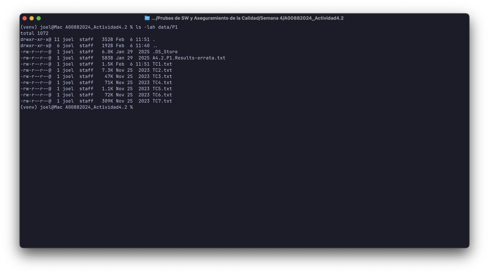
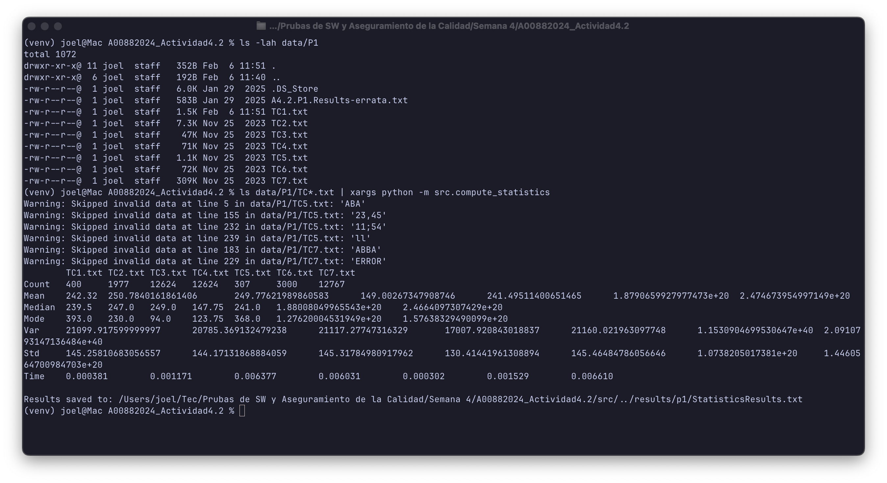
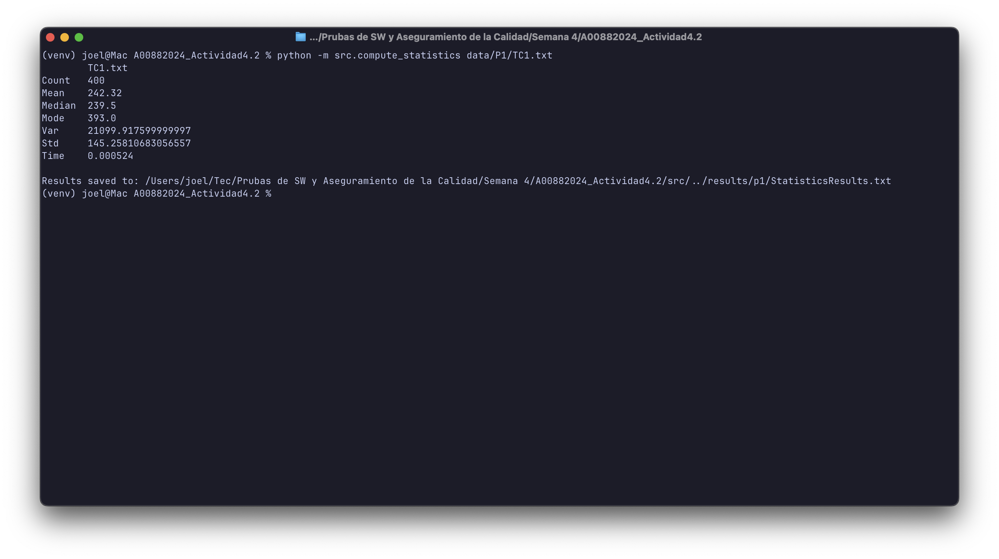
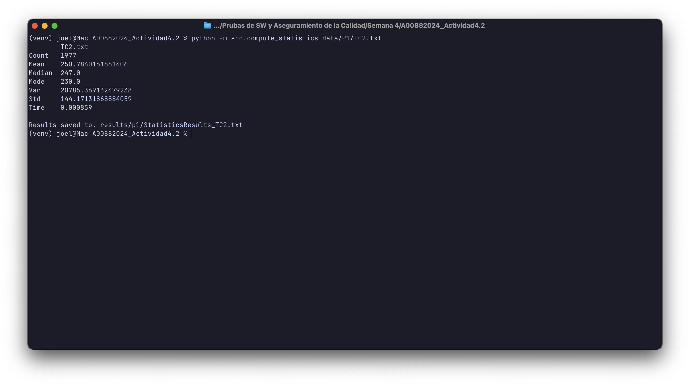
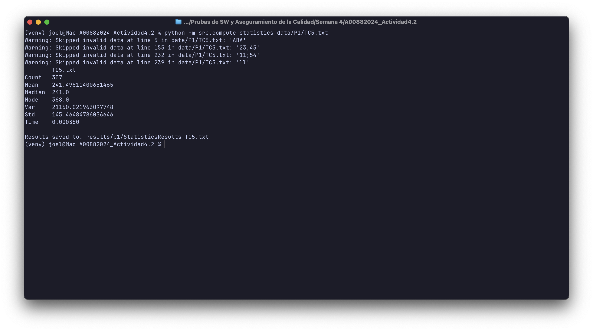
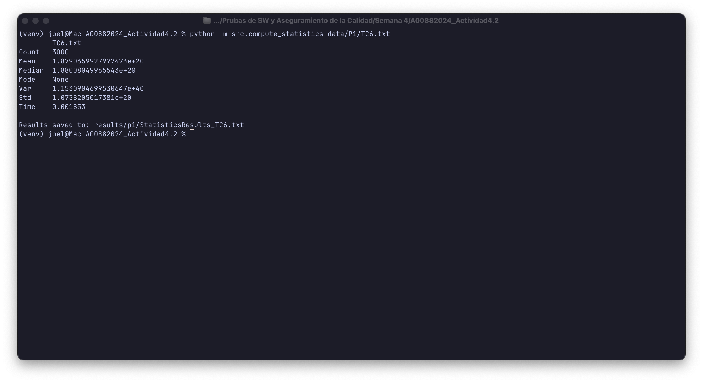
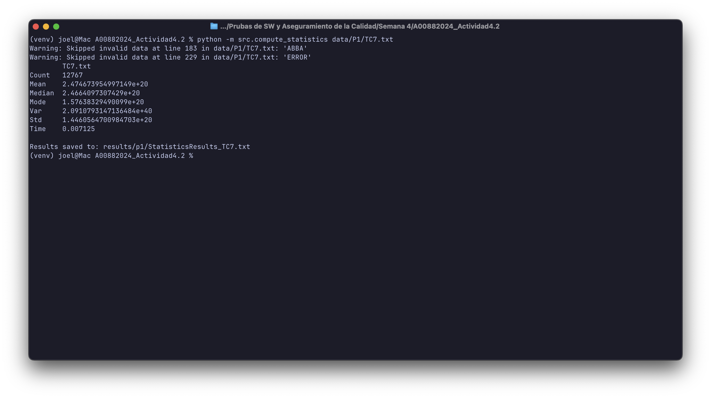

# A00882024_Actividad4.2

**Name:** Joel Garcia Martinez
**Matricula:** A00882024

## Setup

Create and activate a virtual environment:

```bash
python3 -m venv venv
source venv/bin/activate
```

## Install Dependencies

```bash
pip install -r requirements.txt
```

## Run Tests

```bash
pytest
```

## Run Pylint

```bash
pylint src/ tests/
```

## P1 Compute Statistics

Run with one or more data files (one number per line):

```bash
python -m src.compute_statistics <filepath1> [filepath2] ...
```

Example:

```bash
python -m src.compute_statistics data/file1.txt data/file2.txt
```

Results are saved to `results/p1/StatisticsResults.txt`.

### Design Decisions

**File naming (`compute_statistics.py` vs `computeStatistics.py`):**

The script is named `compute_statistics.py` using snake_case instead of `computeStatistics.py` (camelCase) to comply with PEP8 naming conventions. PEP8 specifies that module names should be lowercase with underscores (snake_case). Since Req8 requires PEP8 compliance, we prioritize this standard Python convention.

**File location (`src/` folder):**

The script is located in the `src/` folder rather than the project root to follow standard Python project organization practices. This separation:
- Keeps source code organized and separate from configuration files, tests, and documentation
- Makes the codebase easier to maintain and navigate
- Allows for proper module imports between source files
- Follows common Python project structure conventions

The script can still be executed from the command line using `python -m src.compute_statistics`.

### Screenshots

Screenshots demonstrating the script execution:

- **Data folder structure** - Shows the input data files using `ls` command
  

- **Processing all files** - Demonstrates running the script with all test case files (TC1-TC7)
  

- **Processing TC1** - Output when processing TC1.txt
  

- **Processing TC2** - Output when processing TC2.txt
  

- **Processing TC3** - Output when processing TC3.txt
  

- **Processing TC4** - Output when processing TC4.txt
  

- **Processing TC5** - Output when processing TC5.txt
  

- **Processing TC6** - Output when processing TC6.txt
  

- **Processing TC7** - Output when processing TC7.txt
  

### Result Files

Output files generated by the compute_statistics script:

- [StatisticsResults.txt](results/p1/StatisticsResults.txt) - Statistics for all test cases (TC1-TC7)
- [StatisticsResults_TC1.txt](results/p1/StatisticsResults_TC1.txt) - Statistics for TC1
- [StatisticsResults_TC2.txt](results/p1/StatisticsResults_TC2.txt) - Statistics for TC2
- [StatisticsResults_TC3.txt](results/p1/StatisticsResults_TC3.txt) - Statistics for TC3
- [StatisticsResults_TC4.txt](results/p1/StatisticsResults_TC4.txt) - Statistics for TC4
- [StatisticsResults_TC5.txt](results/p1/StatisticsResults_TC5.txt) - Statistics for TC5
- [StatisticsResults_TC6.txt](results/p1/StatisticsResults_TC6.txt) - Statistics for TC6
- [StatisticsResults_TC7.txt](results/p1/StatisticsResults_TC7.txt) - Statistics for TC7
